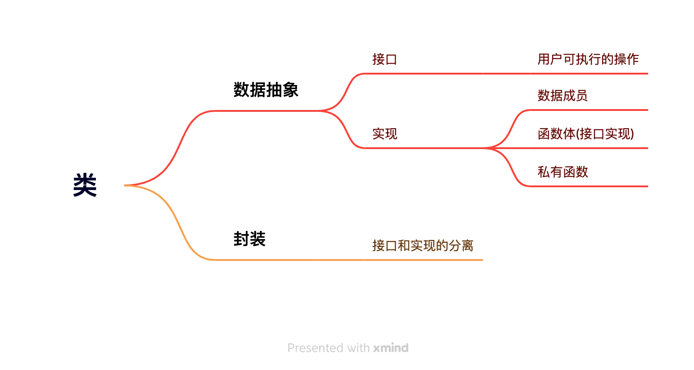

# Chapter 7 Class 类

## 定义抽象数据类型

### 类成员
- 数据成员
  - 声明在类内部
  - this
    - `Sales_data *const. total.combine(trans);` total的地址被绑定到隐式的this参数上。
    - 是一个常量指针，指向的值可以改变， 但是指针的值不能改变(不能指向其他地址，地址值不可变)。
- 成员函数
  - 声明在类内部
  - 定义可内可外
  - 定义在类内部的函数是隐式的`inline`函数

### 非成员函数
- 定义声明都在类外

### 构造函数(constructor) [11,15]
- 类通过一个或者多个成员函数来控制对象初始化过程，这些特殊函数叫做构造函数。
- 编译器创建的**合成默认构造函数**
  - 类内 存在初始值，用它来初始化成员。
  - 默认初始化
  - `=default`表示要求编译器生成构造函数。
- 构造函数初始值列表
  - 唯一的目的就是为数据成员赋值，因此函数体都是空的
  - 位于冒号和花括号之间：`Sales_item(): units_sold(0), revenue(0.0) { }`

## 访问控制与封装
### 访问说明符
- `public` 定义在public后面的成员在整个程序中可以被访问， `public`定义类的接口。
- `private` 定义在private后面的成员可以被类的成员函数访问，但不能被使用该类的代码访问。 `private`隐藏了类的实现细节。
### class vs struct [16,19]
- 唯一的区别是默认**访问权限**不同
  - class(private)
  - struct(public)
### 友元 [20,22] [练习](../ch7/ex7_21.h)
- 允许特定的非成员函数访问一个类的私有成员。
- 声明以关键字friend开始，`friend Sales_data add(const Sales_data&, const Sales_data&);`表示非成员函数`add`可以访问类`Sales_data`的非公有成员。
- 最好在类定义开始或结束前的位置声明友元。
- 友元声明不能代替正常函数声明。
- 类之间的友元类
  - 如果一个类指定了友元类，则友元类的成员函数可以访问此类包括non-public在内的所有成员。
  - 友元类之间不具有传递性。
- 允许以类的一个成员函数声明为友元。

## 类的其他特性
### inline函数 [23,26]
- 类内部，一些较小的函数适合于被声明为内联函数。
- 定义在类内部的成员函数是默认内联的。
- 在类外部定义的成员函数，也可以在声明(类内)时显式的加上`inline`。
### 可变数据成员
- `mutable size_t access_ctr`。
- 即使在const函数中也可以修改。
### 类类型
- 类的声明
  - 声明之后定义之前是不完全类型
  - 可以定义指向这种类型的指针和引用
  - 可以以该类型作为参数或者返回类型的函数声明中，但是不能用在函数定义中。

## 类的作用域
- 一个类是一个作用域
  - 成员访问运算符(`. ->`)
    - 数据成员
    - 函数成员
  - 作用域运算符(`::`)
    - 类类型成员
  - 类外部定义成员函数需要提供类名和函数名
  - 返回类型必须指定它是哪个类的成员 [ex7_33](../ch7/ex7_33.h)

## 构造函数再探
### 初始化(构造函数初始化列表) VS 赋值(构造函数体)
- 如果没有初始化成员，那么在函数体之前会执行**默认初始化**。
- 如果成员是const、引用、或者属于某种未提供默认构造函数的类类型，那么必须初始化而不是赋值。
- 初始化顺序
  - 和初始化列表的位置无关。
  - 和类定义的顺序一致。。
  - 顺序不一致，编译器可能会警告⚠️。
  - 避免使用某些成员初始化其他成员。
### 委托构造函数 `only in C++11`
- 成员初始化列表+函数体
- 初始化列表只有一个入口，就是类名本身
### 默认构造函数的作用
- 参数列表不一定为空， 如果所有参数都有默认值， 那也是默认构造函数
### 转换构造函数
- 只有一个实参的构造函数实际上也定义了一种隐式类型转换机制，我们称这种构造函数为转换构造函数。
- `explicit` 抑制构造函数的隐式转换
- 但是仍然可以显示转换。`Sales_data(str)`
> const reference的初始化时，允许用任意表达式作为初始值，只要该表达式的结果可以转换成引用的类型即可。

### 聚合类
- 特点
  - 所有成员都是public
  - 没有定义构造函数
  - 没有类内初始值
  - 没有基类，virtual函数
- 初始化 `Data val1 = {0, "Anna"};`
  - 顺序一致
  - 少于类成员数量：靠后的成员被值初始化
  - 不能大于类成员数量

### 字面值常量类
- constexpr
  - constexpr变量一定是常量
  - 必须用常量表达式初始化
  - 编译器会验证是变量的值是不是一个常量表达式
- 常量表达式
  - 值不变
  - 编译过程得到计算结果

## 类的静态成员
> 类需要一些成员与类本身直接相关，而不是与类的各个对象。比如银行类中的基准利率，我们希望当利率浮动，所有对象都能使用新值。
- 特点
  - 声明时加上static。
  - 可以是private或public。
  - 常量、引用、指针、类类型。
  - 一旦定义， 存在于程序的整个生命周期。
  - 静态成员方法
    - 不与任何对象绑定
    - 不包含或使用this指针
    - 不能声明为const
- 使用
  - 域运算符。 `Account::rate();`
  - 类的对象、引用、指针类访问。
  - 成员函数可以直接使用静态成员
- 定义or初始化
  - 定义可以在类内部也可以在外部
  - 外部定义时，不必重复static关键字
  - 一般来说必须在类外部定义和初始化静态成员，且只能定义一次。
  - 类内初始化
    - 必须是字面值常量类型
    - 初始值是常量表达式
- 静态和普通成员的区别
  - 静态数据成员的类型可以是 不完全类型、它所属类的类型
  - 静态数据成员可以被用作默认实参

